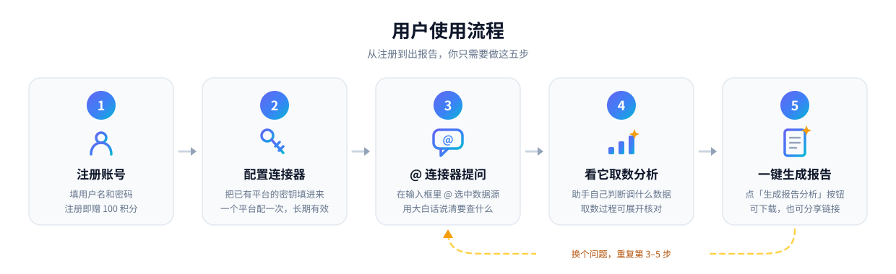

  

<h1 align="center">天机智能体 · 使用指南</h1>

  跨境电商 AI 数据分析助手 —— 一个对话框，问遍你所有的数据平台

> 天机智能体是面向跨境电商卖家的 AI 数据分析助手——把你已经在用的选品、广告、关键词、ERP 平台接进一个对话框，用一句话提问，它自己取数、分析、出结论。本仓库是它的**用户使用指南**。

📖 **在线阅读**：<https://yangyayun2016.github.io/tianji-agent-user-guide/>

## 这是什么

普通 AI 助手只能凭训练时学到的知识回答，问它「我这个 ASIN 上周广告花了多少钱」，它答不上来。天机可以——因为它能连上你自己账号下的数据平台，真的去取数再回答。

本指南讲的是**怎么用**：在哪个页面点什么、怎么提问才问得准、为什么没生效、积分怎么算。全程大白话，不涉及任何技术实现细节。

## 适合谁读

| 角色 | 典型用法 |
|---|---|
| 选品 / 产品经理 | 一个品类值不值得进、竞品格局怎么样、趋势在涨还是在跌 |
| 广告优化师 | 广告结构诊断、Campaign 贡献拆解、关键词坑位监控 |
| 运营 | 关键词研究、Listing 流量结构、竞品评论洞察 |
| 店铺负责人 / 老板 | 每天早上一份自动生成的销售与广告日报 |
| 团队管理者 | 把团队运营 SOP 传进知识库，让新人问助手而不是问你 |

## 指南目录

### 开始之前

| 文档 | 内容 |
|---|---|
| [产品介绍](docs/introduction.md) | 天机是什么、适合谁、跟通用 AI 助手的区别 |
| [产品定位](docs/tianji-agent.md) | 为什么需要天机、核心特性、连接器矩阵、路线图 |
| [快速开始](docs/getting-started.md) | 10 分钟走完注册 → 选模型 → 配连接器 → 第一次提问 |

### 核心功能

| 文档 | 内容 |
|---|---|
| [智能对话](docs/chat.md) | 主入口：怎么提问、一次回答里能看到什么、断线不丢、导出与分享 |
| [技能](docs/skills.md) | 四位内置分析师（选品 / 广告 / 数据 / 关键词）及各自的分析框架 |
| [连接器](docs/connectors.md) | 7 个数据平台的配置方法、能问什么、示例提问 |
| [知识库](docs/knowledge-base.md) | 上传自有资料，让助手基于你的规范回答 |
| [数据库连接](docs/database.md) | 连自己的业务库，用大白话查数据（含安全边界说明） |
| [报告与定时任务](docs/reports-and-schedule.md) | 一键生成分析报告、设定周期任务自动跑 |
| [飞书接入](docs/feishu.md) | 在飞书里 @ 机器人提问，以及它的能力边界 |
| [积分与邀请](docs/credits.md) | 积分怎么获得、怎么消耗、邀请好友、省积分的用法 |

### 遇到问题

| 文档 | 内容 |
|---|---|
| [常见问题](docs/faq.md) | 账号 / 模型 / 连接器 / 对话 / 知识库 / 数据库 / 报告 / 积分 / 飞书 |
| [管理后台](docs/admin.md) | 仅站点管理员需要：会员管理、积分调整、公告、用量监控 |

## 上手流程

  

1. **配一次密钥** —— 在「连接器」页把你已有的平台账号密钥填进去，一个平台配一次，以后一直有效
2. **提问** —— 在对话框里 `@` 选中连接器，用大白话问，比如「帮我看看这个 ASIN 最近 30 天的 BSR 走势」
3. **看结论** —— 助手会先展示它调用了哪些数据源、取到了什么，再给出分析结论；需要的话一键生成报告

详见[快速开始](docs/getting-started.md)。

## 关于本仓库

本仓库只包含面向用户的使用文档，不涉及产品的技术实现。文档如有疏漏或与实际使用不符，欢迎提 Issue。

`prompts/` 目录按时间顺序保存了本站点建设过程中的原始需求，仅作记录。
